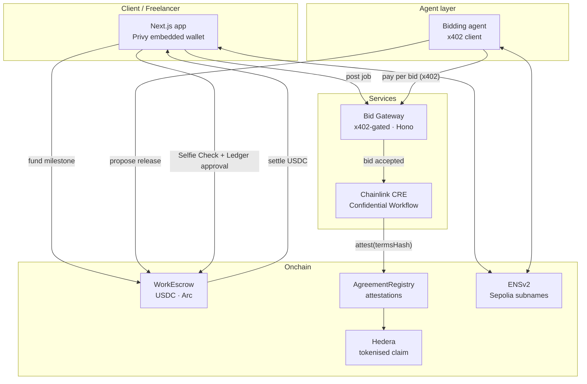

# Tender — Technical Spec

**ETHOnline 2026 · 4–16 September · 3 builders**

An agent-mediated work marketplace with an anti-Sybil economy.

---

## 1. The mechanism

Freelancers and clients hold **ENS subnames**. Agents bid for work on a human's behalf, and
**every bid costs money over x402** — so spam has a price — and carries **proof-of-human**.
Agreed terms stay private inside a **Chainlink Confidential Workflow** that attests the
agreement onchain without publishing it. Escrow settles in **USDC on Arc**. Release is
*proposed* by the agent and *approved* on a **Ledger signer**, with **World Selfie Check**
escalating on high-value payouts. Wallets are invisible via **Privy**. A live contract can be
**tokenised on Hedera** as a transferable claim.

Each sponsor owns exactly one step of one coherent mechanism. That is the structure that won
Aegis (ENS 1st + Ledger 2nd) and Stream Vaults (Uniswap 2nd + Ledger 4th) at New York 2026 —
not a product with integrations sprayed across it.

### The one-sentence pitch

> Job marketplaces are drowning in AI-generated applications. Tender makes every bid cost a
> fraction of a cent and carry proof that a real human stands behind it — then settles the
> work onchain without either party publishing their terms.

---

## 2. Why this shape wins

| Failure mode | How Tender avoids it |
|---|---|
| "Escrow dApp #400" | The agent bidding layer + paid bids is the product, not the escrow |
| Sponsor logo-spraying | Each sponsor owns a distinct, load-bearing step (§4) |
| Selfie-as-login | Selfie Check gates *specific consequential actions*, never sign-in (§6) |
| Hand-rolled zk that never finishes | Chainlink Confidential Workflow replaces the bespoke circuit (§7) |
| Nothing to demo on day 12 | Tier 1 alone is a complete, demoable product (§9) |

---

## 3. Domain model

```
Job          posted by a Client. Budget, scope, deadline, required assurance level.
Bid          submitted by an Agent on behalf of a Freelancer. Costs x402 to submit.
Agreement    an accepted Bid. Terms private; hash + attestation onchain.
Milestone    a slice of an Agreement. Funded, submitted, released.
Release      a payout request. Passes through the Risk Gate before funds move.
Identity     an ENS subname (alice.tender.eth) owning records for both humans and agents.
```

State machine for an Agreement:

```
Proposed ──accept──► Active ──submit──► MilestoneSubmitted ──propose──► ReleasePending
                        ▲                                                    │
                        └──────────────── release ◄──── RiskGate.pass ───────┤
                                                                             │
                                          Disputed ◄──── RiskGate.fail ──────┘
```

---

## 4. Sponsor → component map

Every row is a step in the mechanism. If a row could be deleted without breaking the product,
it does not belong here.

| Sponsor | Owns | Component | Track | Prize |
|---|---|---|---|---|
| **ENS** | Identity | ENSv2 subnames for humans + agents; records hold payout chain, assurance level, reputation pointer | Best Use of ENSv2 | $4,500 |
| **World** | Risk gate | Selfie Check escalation on consequential actions | Selfie Check | $3,500 |
| **Arc** | Settlement | USDC escrow, milestone payouts | DeFi + Agentic Economy | $3,334 |
| **Arc** | Settlement | Mainnet deployment path | Testnet → Mainnet | $3,500 |
| **Privy** | Onboarding | Embedded wallets; a freelancer never sees a seed phrase | B2B Financial Product | $2,500 |
| **Hedera** | Metering | Live x402-gated bid service + the platform consuming it | AI & Agentic Payments | $6,000 |
| **Hedera** | Claims | Agreement tokenised as a transferable claim | Tokenization of Anything | $6,000 |
| **Ledger** | Authority | Human approval of escrow release on a hardware signer | AI Agents × Ledger | $3,500 |
| **Chainlink** | Privacy | Confidential Workflow holding terms, attesting onchain | Best Confidential Workflow | $2,000 |
| **Uniswap** | Payout | Freelancer takes payout in a non-USDC token via Uniswap API | Stack Contribution | $3,000 |
| **Bazantic** | Distribution | Tender's own API behind an Agent Gateway + one Recipe | Agentify + Best Recipe | $2,000 |

**Reachable ceiling: $39,834.** This is a ceiling, not a forecast — placing in four or five is a
strong result.

Deliberately **not** entered: The Graph (no live multi-protocol data to reason over) and
1inch (no novel DeFi primitive). Entering them would be logo-spraying and both sponsors
explicitly penalise it.

---

## 5. Architecture



**Why the gateway is a separate service:** Hedera's AI & Agentic Payments track requires you to
*host a live x402-gated service* **and** *build the platform consuming it*. Splitting the bid
endpoint into `services/gateway` satisfies both halves with one architecture, and gives
Bazantic something real to wrap.

---

## 6. The risk gate (World)

**This is the single most important design decision in the project.** World's brief asks for
Selfie Check as a *risk and eligibility signal* — naming risk, fairness, continuity and abuse
prevention. A submission that gates sign-in has misread the product and will not place.

Selfie is the **lowest** of World's three assurance levels (below Official ID and Human), and
returns *medium-assurance* uniqueness. Treat it as a signal, not an identity.

The policy lives in `packages/shared/src/risk.ts` as typed, testable code — not as an `if`
buried in a component. Every consequential action resolves to a `RiskLevel`, and the level
decides what the product allows:

| Action | Condition | Gate |
|---|---|---|
| Browse, post a job, bid | always | none |
| Accept a bid | always | none |
| Release milestone | below threshold | none |
| Release milestone | above threshold | **Selfie + Ledger** |
| First payout to a new counterparty | always | **Selfie** |
| Authorise an agent to spend | always | **Selfie + Ledger** |
| Raise a dispute | always | **Selfie** |
| Recover an account | always | **Selfie** |

Pairing Selfie with the Ledger approval on the same action gives a two-factor release:
**a human proves they are present, then a device proves they consented.** That single sentence
is the Ledger and World submissions at once.

**Deliverable:** a feedback document on docs, UX and edge cases from real Sandbox testing.
It is graded. Write it from notes taken while integrating, not from memory on day 16.

---

## 7. Private terms (Chainlink)

The original idea called for a bespoke zk proof of contract terms. **We are not building that.**

Chainlink's Convergence winners show the same job done far cheaper: TACIT settled OTC trades
with CRE decrypting trade parameters and verifying both counterparties; Aegis-Gate took 1st in
Risk & Compliance for privacy-preserving verification inside a TEE emitting onchain
attestations; Ghost Finance did private lending-rate negotiation.

The pattern is **private data in, verifiable attestation out** — which is exactly our
requirement.

```
Client terms  ─┐
               ├─► CRE Confidential Workflow (TEE) ─► attest(agreementId, termsHash, bothPartiesAgreed)
Freelancer terms ┘                                         │
                                                           ▼
                                                   AgreementRegistry (onchain)
```

Neither side's terms are published. The registry records that a TEE verified both parties
agreed to the same terms hash. Cheaper than a circuit, likelier to finish, and it converts our
riskiest component into a thin-field $2,000 submission.

**Requirement:** register a TEE handler, process sensitive input in-enclave, and show a
simulated or live deployment **with logs**. Chainlink deploys successfully simulated workflows
to the live CRE network during the event — get the simulation passing early.

---

## 8. Repo layout & ownership

```
packages/shared      domain types, risk policy, chain config     — shared
packages/contracts   Foundry: WorkEscrow, AgreementRegistry      — Builder A
apps/web             Next.js: Privy, ENS, Selfie Check, UI       — Builder B
services/gateway     x402-gated bid endpoint (Hono)              — Builder C
services/agent       bidding agent, x402 client                  — Builder C
```

| Builder | Owns | Sponsors |
|---|---|---|
| **A · contracts** | The money path | Arc, Hedera |
| **B · product** | The demo | Privy, ENS, World |
| **C · agents** | The integrations | Ledger, Chainlink, Bazantic, Uniswap |

Builder B owns the demo because **Privy is judged on polish** — mainstream accessibility,
clear user journey, technical finish. That is the one track where the last day of UI work
converts directly into score.

---

## 9. Build order

Tiered so that a slip costs the cheap tracks, never the demo.

### Tier 1 — days 1–6 — $13,834 · *the product must exist*
ENS subnames · Privy auth · Arc USDC escrow + milestones · Selfie Check risk gate.
**If only this ships, we still have a complete product and four submissions.**

### Tier 2 — days 7–11 — $21,000 · *the differentiators*
x402 bid metering + gateway · Hedera tokenised claim · Ledger approval · Chainlink workflow ·
Arc mainnet path.

### Tier 3 — day 12 — $5,000 · *cheap bolt-ons*
Uniswap payout swap + `FEEDBACK.md` · Bazantic Gateway + Recipe. Mostly writing.
Highest dollars-per-hour on the board — skip only if Tier 1 is still unfinished.

---

## 10. Non-goals

- **No custom zk circuits.** Superseded by §7.
- **No token.** Nothing here needs one and it invites questions we can't answer in a 5-min demo.
- **No dispute arbitration system.** Disputes transition state and stop. Resolution is out of scope.
- **No reputation algorithm.** An ENS record pointing at completed-agreement count is enough.
- **No mobile app.** Responsive web only.
- **Not entering The Graph or 1inch.** See §4.

---

## 11. Open questions

- [x] ~~Arc testnet chain ID + USDC address~~ — **verified day 0** against the live RPC.
      Chain `5042002`, RPC `https://rpc.testnet.arc.network`. USDC is the **native gas
      token** at precompile `0x3600…0000`, which answers ERC-20 *reads* but carries no
      bytecode selectors — calls are intercepted natively. `approve()`/`transferFrom()`
      therefore cannot be assumed to behave like a normal token, so `WorkEscrow` settles
      in **native value** and never calls the precompile. Funding a milestone is one
      transaction instead of two, which is a Privy scoring point.
- [ ] **Does `approve()` actually work on the precompile?** We do not depend on it, but
      we should know. One transaction answers it once a deployer is funded (Day 1, A4).
- [ ] **Arc mainnet track** requires deployment-readiness by **30 September**, two weeks after
      judging. Only enter if we intend to keep shipping past the event.
- [x] ~~Register Bazantic~~ — done. The **username still has to
      appear in the submission**. Docs maturity remains unknown: it is a first-time
      sponsor with a thin public footprint, so it is front-loaded to day 1 (C1).
- [ ] **Ledger Agent Stack** — confirm whether a physical device is required for the demo or
      whether the emulator suffices.

---

## 12. Submission artifacts

Several of these are **graded**. Start on day 10, not day 16.

- [ ] Architecture diagram — required by every Arc track (§5 is the source)
- [ ] Demo videos at each sponsor's length — Hedera ≤5 min; cut one master, then trim
- [ ] `FEEDBACK.md` + Uniswap Developer Feedback Form — both required, both graded
- [ ] World feedback document — docs, UX, edge cases, from real Sandbox testing
- [ ] Verified public repo — Hedera requires verification
- [ ] Bazantic account + **username in the submission** — trivially missable, disqualifying
- [ ] Screen recordings for Bazantic — separate from the main demo video
- [ ] Continuous git history — several sponsors judge it; commit daily, never dump at the end
